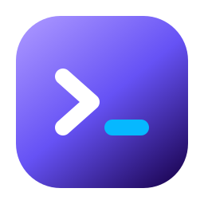
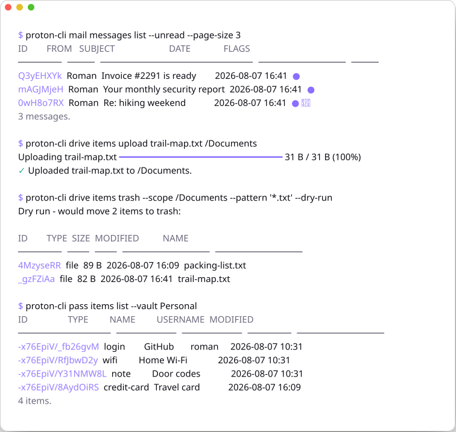

<div align="center">



# proton-cli

**Proton, in your terminal.**

_Unofficial, community-built, not affiliated with Proton AG._

[](https://github.com/roman-16/proton-cli/releases/latest) [](https://github.com/roman-16/proton-cli/releases) [](docs/installation.md) [](LICENSE)

<picture>
  <source media="(prefers-color-scheme: dark)" srcset="assets/demo-dark.svg">
  
</picture>

</div>
<br />

Read your mail, move files in and out of Drive, manage calendars, passwords, and contacts, all without opening a browser. proton-cli logs in the way the Proton apps do and does the encryption on your machine, so your keys stay yours.

- **Real end-to-end encryption.** SRP login and the full PGP key hierarchy, handled locally with Proton's own [go-srp](https://github.com/ProtonMail/go-srp) and [gopenpgp](https://github.com/ProtonMail/gopenpgp). No bridge, no proxy, no browser in the middle.
- **Five apps, one binary.** Mail, Drive, Calendar, Pass, and Contacts, in a single static executable on Linux, macOS, and Windows.
- **Built for pipes and cron.** JSON and YAML with one envelope shape for every list, streaming stdin and stdout, exit codes that mean something, and `--dry-run` on everything that changes state, showing the rows it would touch.

## Install

| Method | Command |
| --- | --- |
| **Linux, macOS** | `curl -fsSL https://raw.githubusercontent.com/roman-16/proton-cli/main/scripts/install.sh \| sh` |
| **Windows** | `irm https://raw.githubusercontent.com/roman-16/proton-cli/main/scripts/install.ps1 \| iex` |
| **Homebrew** | `brew install --cask roman-16/tap/proton-cli` |
| **winget** | `winget install Roman-16.ProtonCLI` |
| **Arch (AUR)** | `yay -S proton-cli-bin` |
| **Nix** | `pkgs.proton-cli` |
| **npm** | `npm install -g @roman-16/proton-cli` |

There's also an APT repository for Debian and Ubuntu, `.rpm` and `.apk` packages, plain binaries with checksums, and `go install`. See [Installation](docs/installation.md).

Already installed? `proton-cli update`.

## Get started

```console
$ proton-cli account login
Email:            you@proton.me
Password:
Two-factor code:  123456

✓ Signed in as you@proton.me.
```

That's the whole setup. Signing in saves the session **and** unlocks your keys, so your password is needed once on this machine and not again. Every command documents itself with `--help`, and shell completion knows the whole tree:

```bash
proton-cli mail messages list
proton-cli completion zsh > "${fpath[1]}/_proton-cli"
```

Prefer the environment? `PROTON_USER` and `PROTON_PASSWORD` are used instead of being asked for. Juggling a personal and a work account? `proton-cli --profile work account login`. More in [Getting started](docs/getting-started.md).

## What you can do

Every command reads the same way - `proton-cli <app> <collection> <verb>` - and anywhere one wants an ID, a subject, name, or URL works too. Lists shorten IDs to 8 characters you can paste straight back. See [The language](docs/language.md).

### Mail

```bash
proton-cli mail messages list --unread
proton-cli mail messages search --from billing@example.com --after 2026-01-01
proton-cli mail messages get "Invoice #2291"
proton-cli mail messages send --to alice@proton.me --subject Report \
  --body "See attached." --attach ./report.pdf
proton-cli mail messages reply "Invoice #2291" --body "Thanks, paid today."
proton-cli mail messages forward "Invoice #2291" --to alice@proton.me
proton-cli mail drafts create --to team@example.com --subject Standup --body "Notes to follow."
proton-cli mail messages label "Invoice #2291" --label Accounting
proton-cli mail messages export --folder archive --older-than 1y --output-dir ./backup
proton-cli mail messages trash --unread --older-than 30d
```

Threads, drafts, attachments, `.eml` export, folders and labels as separate things, Sieve filters, signatures, and an auto-reply. → [Mail](docs/commands/mail.md)

### Drive

```bash
proton-cli drive items list /Documents
proton-cli drive items upload --recursive ./project /Backup
proton-cli drive items download /Documents/report.pdf --output-dir .
proton-cli drive items move /Documents/report.pdf --into /Archive
proton-cli drive share link /Documents/report.pdf --expires 7d --password hunter2
proton-cli drive items trash --pattern "*.tmp" --scope /Build --recursive
```

Plus revisions, sharing with people, trash, and photo albums. → [Drive](docs/commands/drive.md)

### Calendar

```bash
proton-cli calendar events list --start 2026-04-15 --end 2026-04-30
proton-cli calendar events create --title Dentist --start 2026-04-16T14:00 --duration 1h
proton-cli calendar events create --title Standup --start 2026-04-16T09:00 \
  --duration 15m --rrule "FREQ=WEEKLY;COUNT=10" --remind 15m
proton-cli calendar events respond "Team sync" --status accept
```

Plus calendars of your own, all-day events, and attendees who get an invitation by email. → [Calendar](docs/commands/calendar.md)

### Pass

```bash
proton-cli pass items list --vault Work
proton-cli pass items get github.com
proton-cli pass items create --name GitHub --username roman \
  --password "$(openssl rand -base64 24)" --url github.com
proton-cli pass aliases create --prefix shop --mailbox me@proton.me
```

Logins, notes, cards, Wi-Fi, SSH keys, identities, custom items. → [Pass](docs/commands/pass.md)

### Contacts

```bash
proton-cli contacts list
proton-cli contacts create --name "Jane Roe" --email jane@example.com
proton-cli contacts keys pin jane --key jane-pubkey.asc
proton-cli contacts groups add GROUP_ID jane
```

Groups, several addresses per contact, and details like organization and birthday. → [Contacts](docs/commands/contacts.md)

### Account

```bash
proton-cli account get
proton-cli account sessions list
proton-cli account settings set locale de_AT
proton-cli account logout --revoke
```

Sessions across your devices, profiles on this machine, and settings scoped the way Proton scopes them: `proton-cli account settings` plus `mail`, `calendar` and `drive` settings per product. → [Account](docs/commands/account.md)

[`proton-cli api`](docs/commands/api.md) reaches any endpoint the commands don't.

## Automate it

```bash
# creating something prints its new ID to stdout
ID=$(proton-cli mail settings labels create --name Work --color "#8080FF")

# every list is an envelope keyed by its plural name, always with a count
proton-cli mail messages list --unread --output json | jq -r '.messages[].subject'
proton-cli drive items list /Backup --output json | jq '[.items[].size] | add'

# stream through, no temporary files
pg_dump mydb | gzip | proton-cli drive items upload - /Backups/db.sql.gz

# archive a folder to disk as ordinary .eml files
proton-cli mail messages export --folder archive --all --output-dir ./mail-backup

# check what a bulk change would touch before it happens
proton-cli mail messages trash --from newsletter@example.com --older-than 90d --dry-run
```

Data goes to stdout and progress to stderr, so redirects stay clean. Exit codes tell user error, auth failure, not-found, ambiguity, and network trouble apart, so scripts can react to each. → [Scripting](docs/scripting.md)

## Encryption you can verify

Your password never reaches Proton: login is SRP, and the key password it derives stays local and unlocks your PGP keys in memory. Mail, files, events, contacts, and Pass items are decrypted after they arrive and encrypted before they leave, with the same key hierarchy the web clients use. Signatures on incoming mail are checked and reported.

The saved session keeps your key password encrypted with a key held server-side, so revoking the session from any Proton app makes a leaked copy of the file useless. proton-cli is unaudited, and the whole storage model is written down in [Security](SECURITY.md). The mechanics are in [How it works](docs/how-it-works.md).

## Documentation

Everything lives in [`docs/`](docs/README.md):

| Page | What's in it |
| --- | --- |
| [Installation](docs/installation.md) | Every platform, updating, uninstalling |
| [Configuration](docs/configuration.md) | Credentials, profiles, environment variables |
| [Getting started](docs/getting-started.md) | Signing in, completion, profiles |
| [The language](docs/language.md) | The grammar: apps, collections, verbs, filters |
| [Output](docs/output.md) | The four response kinds, JSON, colour, exit codes |
| [References](docs/references.md) | Names, short IDs, compound IDs |
| **Command reference** | [Everything](docs/commands/README.md) · [Mail](docs/commands/mail.md) · [Drive](docs/commands/drive.md) · [Calendar](docs/commands/calendar.md) · [Pass](docs/commands/pass.md) · [Contacts](docs/commands/contacts.md) · [Account](docs/commands/account.md) · [API](docs/commands/api.md) |
| [Scripting](docs/scripting.md) | Pipelines, `jq`, cron and systemd |
| [How it works](docs/how-it-works.md) | Login, keys, what's encrypted with what |
| [Limitations](docs/limitations.md) | Platform constraints and gaps |

## Good to know

- **Search lags a few seconds.** Proton's index is eventually consistent, so act on the ID a command printed rather than searching for the same subject again.
- **CAPTCHAs need a desktop.** Proton occasionally asks for human verification at login, which opens a small window. On a headless machine, log in elsewhere and copy the session. See [Human verification](docs/human-verification.md).
- **Colors are Proton's.** Labels, folders, calendars, and groups accept only the 20 accent colors; an invalid `--color` prints the whole palette.
- **Folders and labels are different.** A message lives in one folder and carries any number of labels, so `move --into` and `label --label` are separate verbs.

## Contributing

Bug reports, ideas, and pull requests are all welcome. [`CONTRIBUTING.md`](CONTRIBUTING.md) covers the setup, and [`SECURITY.md`](SECURITY.md) has the private channel for security issues.

## Disclaimer

proton-cli is an independent, community-built project. It is not endorsed by, affiliated with, or supported by Proton AG. Proton is a trademark of Proton AG. Use it at your own risk, and mind Proton's terms of service.

## License

[MIT](LICENSE)
